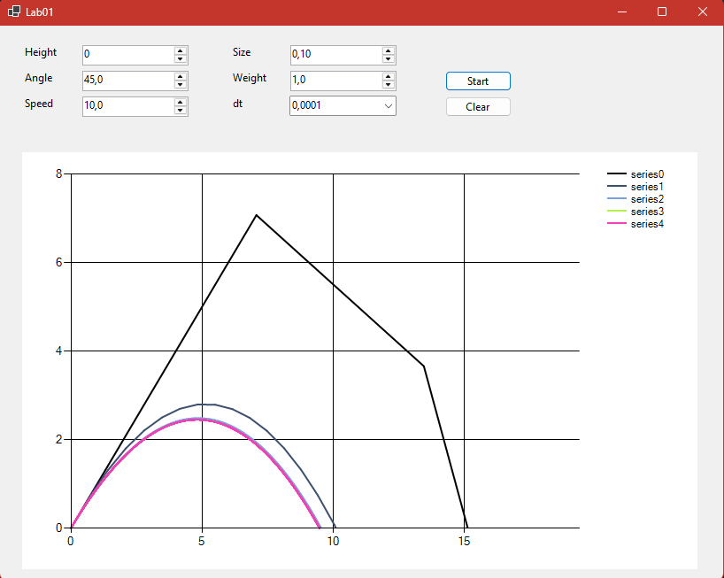

### Моделирование полёта тела в атмосфере

**Задание:**  
>Реализовать приложение для моделирования полёта тела в атмосфере.  
Предусмотреть возможность ввода шага моделирования и вывода результатов.

# **
 Отчёт 
**

## ***
Метод Эйлера и Рунге-Кута для полёта тела в атмосфере
***
### 
Математическая модель

$$
\begin{aligned}
\frac{dV_x(t)}{dt} = - k * {V_x(t)} * V(t),\\
\frac{dV_y(t)}{dt} = - g - k * V_y(t) * V(t),\\
V_x(0) = V_0 * cos ɑ, V_y(0) = V_0 * sin ɑ.\\
k = \frac{C * S * \rho}{2m}\\
\end{aligned}
$$

***
# **
Демонстрация результатов работы программы
**

| Шаг моделирования, с | 1 | 0.1 | 0.01 | 0.001 | 0.0001 |
|----------------------|---|-----|------|-------|--------|
| Дальность полёта, м |19.39|10.68|9.58|9.49|9.48|
| Максимальная высота, м |7.07|2.79|2.48|2.45|2.45|
| Скорость в конечной точке, м/с |14.26|9.91|9.34|9.31|9.31|

## **
График
**

***
# **
Выводы
**

### 
1. С уменьшением шага моделирования результаты стремяться к определённому значению:

>*Для данных Height = 0, ɑ = 45°, m = 1 кг, v0 = 10 м/с, S = 0.1 м²*
- *Дальность:* 9.48 м
- *Максимальная высота:* 2.45 м
- *Конечная скорость:* 9.31 м/с

***
Это говорит о том, что метод Эйлера сходится к точному решению.
***
***
### 2. Важность выбора шага
- Шаг ∆t = 1 даёт абсолютно неверный результаты
- Шаг ∆t = 0.1 уже даёт приемлемую точность
- Шаг ∆t = 0.01 и меньше дают приактически одинаковые результаты
***

### 3. Оптимальный шаг

Для практических расчетов можно выбрать шаг dt = 0.01. Дальнейшее уменьшение шага (на порядок и более) при использовании методов Эйлера или Рунге-Кутты приведет к существенному росту вычислительных затрат, не обеспечивая при этом заметного улучшения точности по сравнению с выбранным значением.

